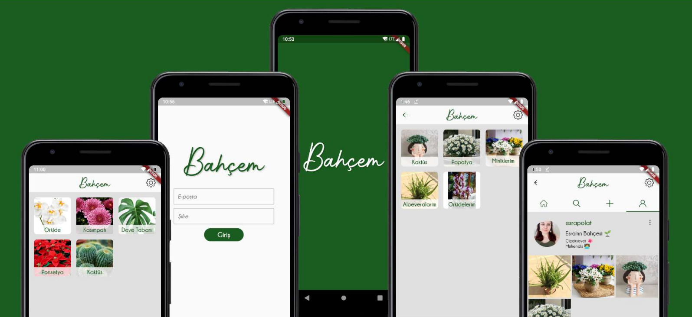
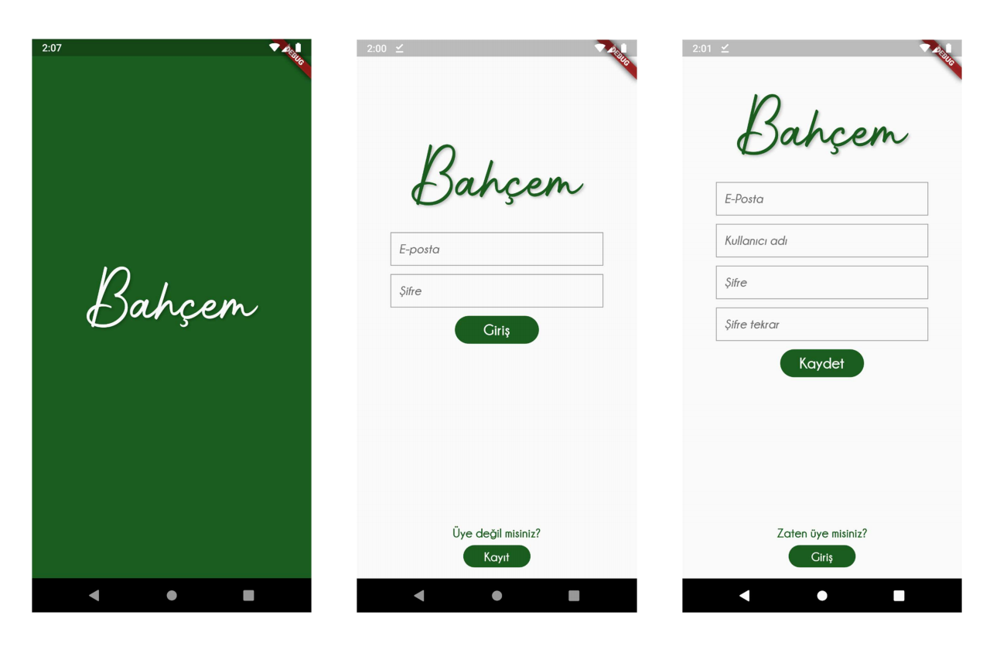
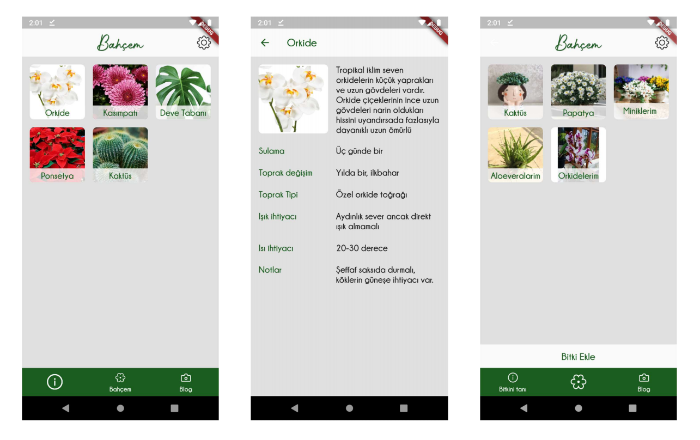
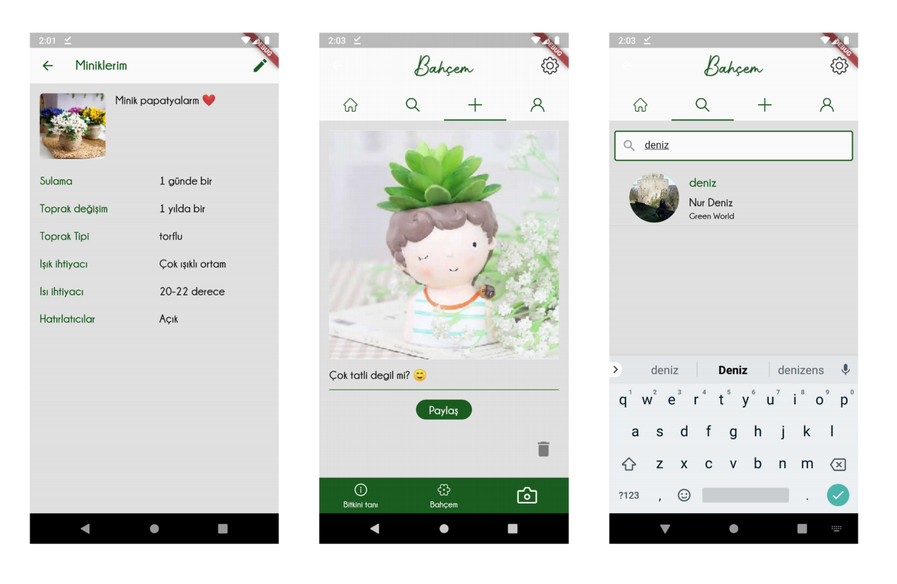
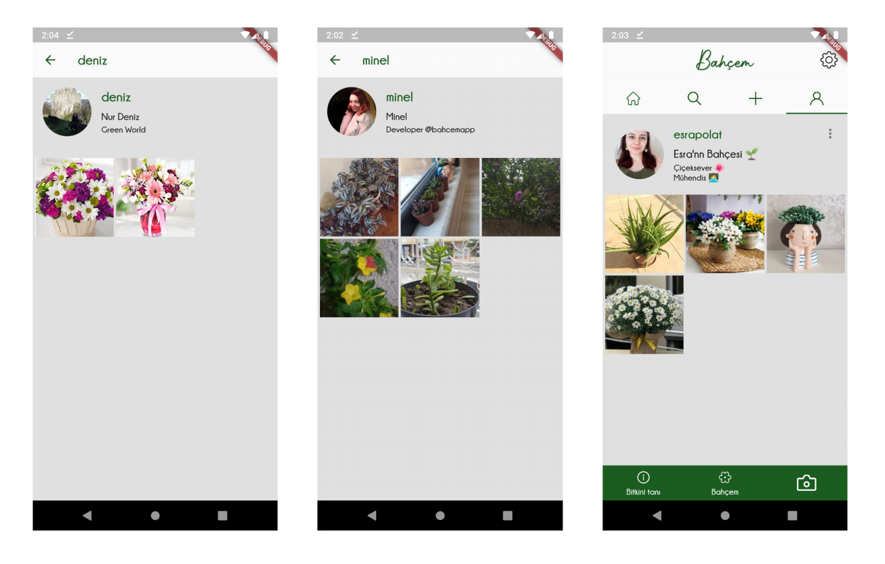
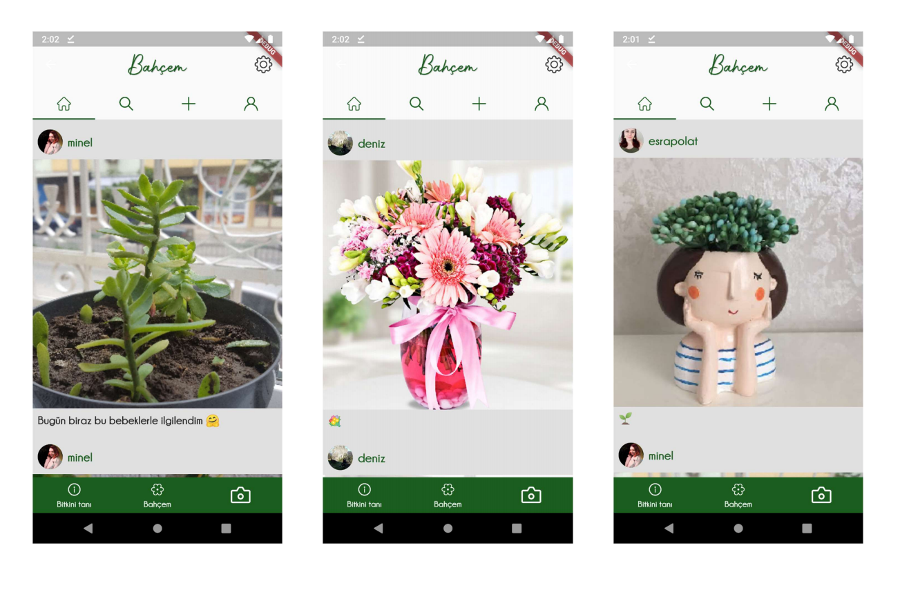
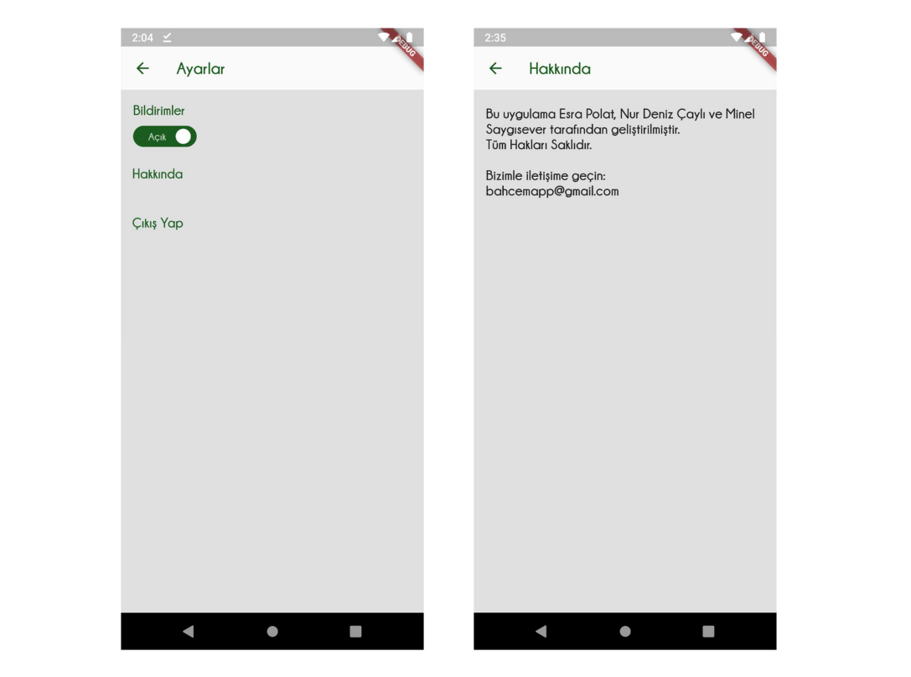

## BAHÇEM

A platform where you can get information about plants, follow your own plants, and share your plants on your own blog.

It was written with a team of three, using **Flutter** and **Firebase**.

# Developers
* Esra POLAT - https://github.com/esra-polat
* Minel SAYGISEVER - https://github.com/minelsaygisever
* Nur Deniz ÇAYLI - https://github.com/nurdenizcayli

# Sample Interface

